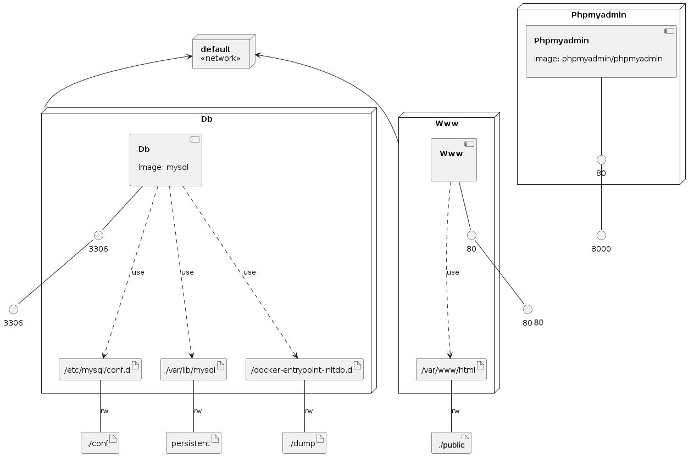

# Docker LAMP (Linux Apache MySQL PHP)

Docker with PHP, XDebug, Apache, MySQL and PHPMyAdmin.

I use docker-compose as an orchestrator. To run these containers:

```
docker-compose up -d or right button on docker-compose.yml + Compose Up
```

## Phpmyadmin
Open phpmyadmin at [http://localhost:8000](http://localhost:8000) or [http://127.0.0.1:8000](http://127.0.0.1:8000)
- user: root
- password: test

## Example
Open web browser to look at a simple php example at [http://localhost:8080](http://localhost:8000) or [http://127.0.0.1:8090](http://127.0.0.1:8000)

## Your project
Clone YourProject on `public/` and then, open web [http://localhost/YourProject](http://localhost/YourProject) or [http://127.0.0.1/YourProject](http://127.0.0.1/YourProject)

### Infrastructure model

